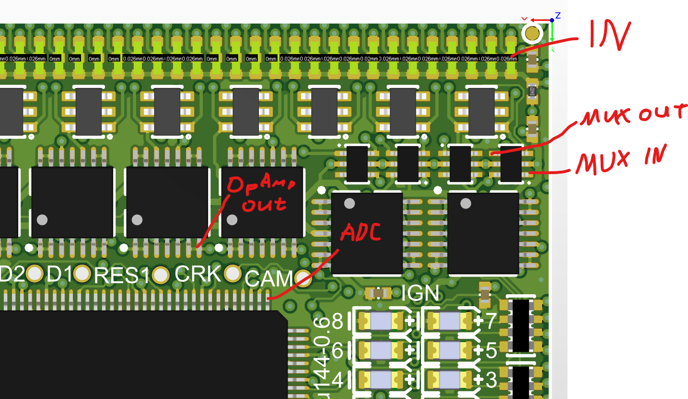

https://github.com/andreika-git/hellen-one/wiki/module-mega-mcu

See also https://github.com/rusefi/fw-custom-hellen144-f4

# troubleshooting PPS

IN — input from the connector

MUX IN — after the protection IC

MUX OUT — multiplexer output

OpAmp OUT — amplifier output

ADC — microcontroller input after a 2:1 divider